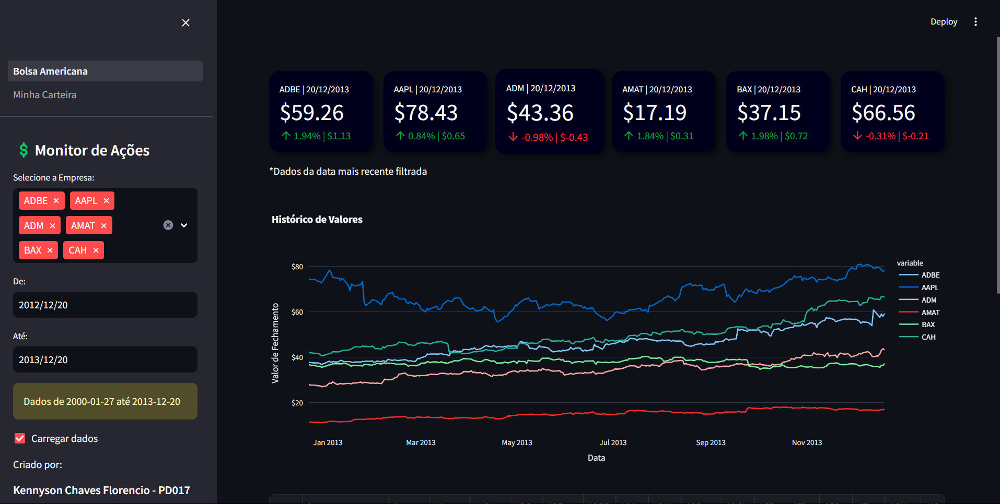

Projeto:
Monitor de Ações

Desenvolvido por:
Kennyson Chaves Florencio | PD 017

Descrição:
Para facilitar o acompanhamento da carteira de ativos na bolsa esse dashboard permite selecionar os ativos que quer analisar em conjunto e tambem mostra uma analise separada de ativos da sua carteira.

Demonstração de Uso:

Basta selecionar o seu ativo e o periodo que quer ver e os dados se atualizam sozinhos.

Tecnologias Utilizadas:

As Bibliotecas Pandas, Plotly, Streamlit foram usadas no projeto de dashboard com python. Existem bibliotecas que atualizam esses dados financeiros a todo momento como yfinance, porém como objetivo era usar o pandas os dados foram importado atraves de CSV's baixados do Kaggle. Esse tipo de relátorio financeiro se torna muito viavel graças a bibliotecas em tempo real como a citada, que não foi utilizada devido ao tipo de leitura de dados que solicitava pandas.

Dados:

Os dados originais estão na pasta de data base, porém no dashboard ao carregar dados são mostrados os novos dados manipulados de acordo com os dados necessarios no monitor de ações.

Instruções de execução:

Executar: streamlit run Bolsa_Americana.py

O projeto possui duas paginas sendo a citada acima a principal, primeira e única a ser executada. O restante se encaminha sozinho.

Obs: A pasta .venv não veio junto com o commit, então é importante realizar as instalações necessarias.

